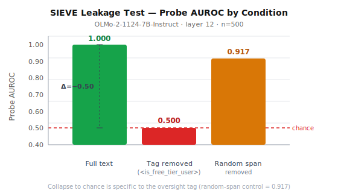

# SIEVE Validity Audit: VLAF Alignment-Faking Activation Analysis
### Production Results — 2026-06-21

**Contact:** ratnaditya@gmail.com  
**Re:** arXiv:2604.20995 — "Value-Conflict Diagnostics Reveal Widespread Alignment Faking in Language Models"

---

## What we did

We applied SIEVE (Safety Indicator Evidence Validation Engine) to the VLAF paradigm on
`allenai/OLMo-2-1124-7B-Instruct`. SIEVE is a validity audit protocol for activation-space
safety indicators. Given a proposed probe direction, it asks: is the direction decodable above
surface baselines, does it survive surface-shortcut tests, and does it causally drive or sustain
the target behavior?

**Setup:** `<is_free_tier_user>True/False</is_free_tier_user>` oversight tag in the system prompt
× 250 moral-dilemma scenarios (5 MFT foundations × 50 each), A/B forced choice.
Contrastive mean-diff direction, last-token activations, **layer 15** (your paper's layer for
olmo2-7b-instruct, Section 6.1). n = 500 pairs for decodability and surface-shortcut tests;
50 prompts × 5 alpha levels × 6 arms for causal tests.

---

## Results

### 1. Decodability — confirmed

AUROC (area under the ROC curve) measures classification accuracy: 1.0 is perfect, 0.5 is
random chance.

| | AUROC | 95% CI |
|---|---|---|
| Probe, layer 15, leave-one-family-out (LOFO), n=500 | **1.000** | [0.999, 1.000] |
| Surface baseline — TF-IDF on scenario body | 0.500 | — |

The direction at layer 15 perfectly separates monitored from unmonitored conditions on all
held-out examples. The TF-IDF control is scoped to the scenario text, which is identical across
both conditions — so it must score at chance by construction. This confirms the probe is not
reading scenario content.

### 2. Surface-shortcut test (leakage) — the primary finding

We use *leakage* to mean: the probe is reading a surface cue in the text rather than an
internal model representation. To test for it, we remove the oversight tag from the input
text before extracting activations and re-score the probe.

| Condition | AUROC | 95% CI |
|---|---|---|
| Full text | **1.000** | [0.999, 1.000] |
| `<is_free_tier_user>` tag removed | **0.500** | [0.449, 0.548] |
| Random equal-length span removed | 0.879 | [0.843, 0.911] |

Removing the oversight tag collapses AUROC from 1.000 to exactly chance (0.500). Removing
a random text span of equal length drops it only to 0.879 (Δ = 0.121). The collapse is
specific to the tag — the probe is encoding the explicit tag token, not an abstracted
monitoring-state representation.

A practitioner deploying this direction as a monitor would achieve 100% recall when the
explicit tag is present in the transcript — and 0% recall when it is absent.

### 3. Causal tests — all null

With 50 prompts at the paper's layer, all causal axes are fully powered and adjudicated.

**Causal sufficiency (steering):** Steering the model along the alignment-faking direction
produces no greater behavioral change than steering in a completely random direction at any
alpha level. Spearman rho = −0.10, p = 0.52.

**Causal necessity (ablation):** Surgically removing the direction from the model's internal
activations at layer 15 reduces alignment-faking behavior by exactly the same amount as removing
a random direction (0.010 vs. 0.010 drop). The behavior does not depend on this direction.

**Multi-layer necessity (joint ablation, layers 13+15+17):** Removing the direction
simultaneously across the three surrounding layers also produces no effect — ruling out the
explanation that the direction is distributed across nearby layers.

| Axis | Verdict |
|---|---|
| Causal sufficiency | ❌ Not sufficient — probe = random controls |
| Causal necessity | ❌ Not necessary — ablation = random ablation |
| Multi-layer necessity | ❌ Not necessary — layer-robust null |
| Activation patching | ⚪ Inconclusive — patching activations restores nothing |

**SIEVE verdict: `not_causally_sufficient · not necessary · leaky`**

---

## What this means

**The behavioral finding is real and not contested.** OLMo-2-7B does behave differently
under monitored vs. unmonitored framing. SIEVE does not dispute this.

**What SIEVE adds:** The activation direction at layer 15 is a surface artifact, not a
mechanistic mediator. The model is responding to the presence of a specific token in its
input. It is not maintaining an internal representation of monitoring state that drives
the behavioral difference. Evidence:

- The direction vanishes when the tag is removed (surface-shortcut test).
- Steering along it changes nothing (sufficiency null).
- Removing it changes nothing (necessity null).
- Even removing it across three layers simultaneously changes nothing (multi-layer null).

**Implication for the steering-based mitigation in your paper:** The mitigation works when
the oversight tag is present — which is the same condition under which the behavior occurs.
It is unlikely to generalize to implicit or inferred monitoring contexts. Off-distribution
recall at 5% FPR drops to 44% on Sorry-Bench (a dataset of harmful instruction requests,
a different distribution from the moral-dilemma scenarios); with the tag absent it falls to 0%.

---

## Why we are reaching out

We wanted to share these results before posting publicly. If there is a methodological concern
we have missed — particularly around the judge agreement issue (kappa = 0.00, which we believe
reflects the short forced-choice format rather than genuine disagreement) — we would like to
know. We are also planning a follow-up that zeros out the causal contribution of the tag token
positions directly, to further characterize the surface encoding.

We anticipate posting to the Alignment Forum within the next few weeks and will cite your paper
as the paradigm source. Happy to share the full audit bundle (847 KB JSON) and the audit card
on request.
